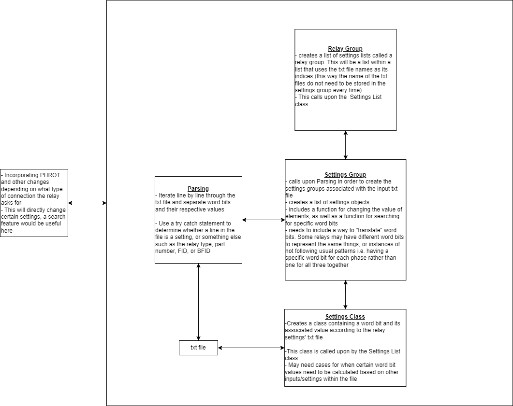
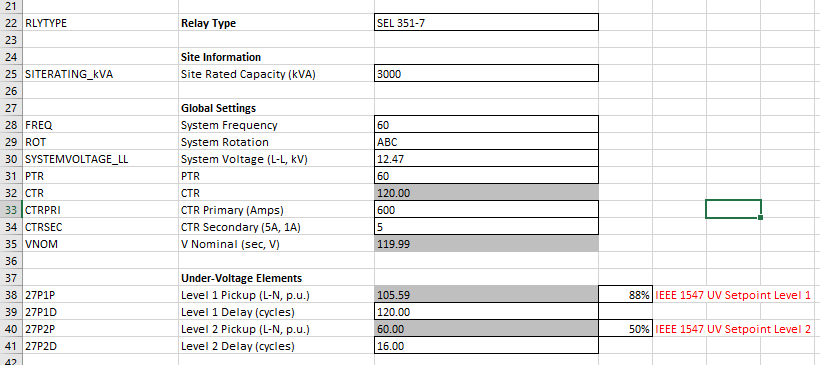

# Settings Helper
This project encompasses the automated programming and settings basis creation of a basic Relay Database using templatized relay (.rdb) files with the use of a simple calculation sheet, translation layer and file management system.

## Application Overview

## Functional Description
To Start, a simple excel spreadsheet with equations and setpoints determined by customer requirements or the engineer is used. This excel spreadsheet uses "generic" WordBits, or WordBits not specific to any relay type, that are seen in Column A in the screenshot below.

The "original" WordBit is then fed to a WordBit translator where the specific relay type is used to lookup the relay specific WordBit. This data is then passed to the `SettingsGroup.cs` class where one can set the appropriate settings parsed from the relay's export function. Once all settings are set, the relay files can then be imported.
## TODO

 - Finalize translation layer `SettingsTranslator.cs`
 - Finalize Settings Group functions in `SettingsGroup.cs`
 - Finalize Settings Basis Template
 - Finalize User Interface
 - Create different relay type Lookup Tables
